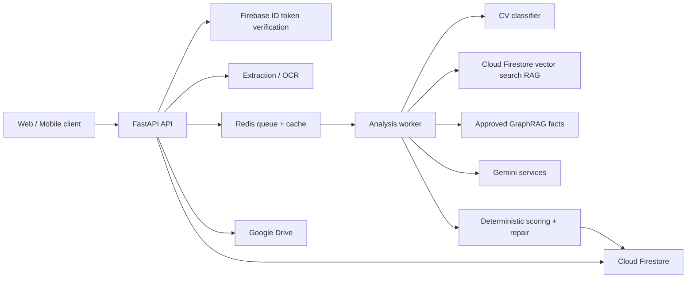

# SupportHR Backend

Backend cho hệ thống hỗ trợ sàng lọc CV bằng AI: trích xuất tài liệu, chuẩn hóa JD, phân tích và xếp hạng ứng viên, giải thích bằng chứng, lưu lịch sử tuyển dụng và hỗ trợ các tác vụ HR.

> Tài liệu này dành cho giám khảo hoặc người đánh giá cần nắm dự án trong 5–10 phút. Code và cấu hình đang chạy là nguồn sự thật kỹ thuật.

## 1. Bài toán

Một đợt tuyển dụng có thể nhận hàng chục hoặc hàng trăm CV với cách trình bày rất khác nhau. Quy trình đọc thủ công thường gặp ba vấn đề:

- tốn thời gian và khó so sánh đồng nhất;
- điểm số khó giải thích hoặc thiếu bằng chứng;
- dữ liệu, lịch sử đánh giá và phản hồi bị phân tán.

SupportHR biến JD và CV thành một pipeline có cấu trúc. Hệ thống hỗ trợ HR ra quyết định, không thay HR đưa ra quyết định tuyển dụng cuối cùng.

## 2. Những gì backend thực hiện

| Năng lực | Cách triển khai |
| --- | --- |
| Đọc CV/JD | Trích xuất PDF, DOCX, ảnh, TXT và CSV; hỗ trợ OCR khi cần |
| Chuẩn hóa JD | Xác định vị trí, cấu trúc JD và bộ lọc cứng |
| Phân tích CV | Job bất đồng bộ qua API, Redis và worker riêng |
| Chấm điểm | Rubric, trọng số, rule kiểm tra và Gemini output có schema |
| Giải thích | Điểm mạnh, điểm yếu, cảnh báo và bằng chứng từ CV |
| Phân loại ngành | Model TF-IDF + LinearSVC/Logistic Regression được đóng gói kèm manifest |
| RAG | Cloud Firestore vector search tìm exemplar đã được phê duyệt |
| GraphRAG | Chỉ đọc fact đã duyệt, có provenance và `decisionImpact=none` |
| Dữ liệu người dùng | Firebase Authentication, Cloud Firestore, ownership theo người dùng |
| Tích hợp | Google Drive, email, chatbot, notification và salary analysis |
| Vận hành | Docker Compose, K3s/Kubernetes, health check, rollback và CI build image |

## 3. Điểm khác biệt kỹ thuật

SupportHR không gửi toàn bộ CV vào một prompt rồi tin trực tiếp vào câu trả lời. Các trách nhiệm được tách thành những contract độc lập:

1. **Classifier đã huấn luyện** chỉ hỗ trợ routing/ngành nghề.
2. **RAG/vector search** chỉ truy xuất exemplar đã được phê duyệt.
3. **GraphRAG** cung cấp bằng chứng tham khảo; chế độ shadow không thay đổi điểm.
4. **Gemini** xử lý phần suy luận ngôn ngữ theo schema.
5. **Rule và scoring xác định** kiểm tra, sửa và chuẩn hóa kết quả.
6. **Worker bất đồng bộ** tách tác vụ dài khỏi request HTTP.

Thiết kế này giúp kiểm thử từng lớp, giảm phụ thuộc vào một model duy nhất và giữ được khả năng giải thích.

## 4. Kiến trúc



Luồng phân tích chính:

```text
JD + CV
  -> extract/normalize
  -> classifier routing
  -> approved RAG/GraphRAG evidence
  -> Gemini structured analysis
  -> deterministic validation/scoring
  -> ranking + HR summary + evidence
  -> Cloud Firestore history/feedback
```

## 5. Cấu trúc repository

```text
cv-match-api/
├─ api_server/
│  ├─ app/
│  │  ├─ api/routes/       HTTP endpoints
│  │  ├─ schemas/          Pydantic request/response
│  │  ├─ services/         AI, OCR, scoring và workflow
│  │  ├─ repositories/     Firestore data access
│  │  ├─ integrations/     Firebase Admin, Gemini, Redis
│  │  ├─ models/           Classifier artifact + manifest
│  │  └─ main.py           FastAPI entrypoint
│  ├─ data/graphrag/       Graph artifact đã qua release gate
│  ├─ tests/               Backend tests
│  ├─ Dockerfile
│  └─ requirements.txt
├─ ml_pipeline/            Pipeline dữ liệu/huấn luyện chạy offline
├─ Web/Rules/firebase/     Firestore rules và indexes (Web-owned, Android-consumed)
├─ deploy/kubernetes/      Base + local/OCI/production overlays
├─ deploy/vps/             Bootstrap, deploy, health và rollback
├─ docker-compose.yml      Local: API + Redis + worker
├─ compose.production.yaml Production một VPS
└─ render.yaml             Render free demo (một web process)
```

Các điểm vào nên xem:

- [FastAPI entrypoint](api_server/app/main.py)
- [API routes](api_server/app/api/routes)
- [CV pipeline](api_server/app/services/cv_pipeline_service.py)
- [GraphRAG service](api_server/app/services/graph_rag_service.py)
- [Classifier service](api_server/app/services/local_classifier_service.py)
- [Firestore repositories](api_server/app/repositories/firestore)
- [Backend tests](api_server/tests)
- [FE API contract](api_server/docs/FE-API-CONTRACT.md)
- [ML pipeline](ml_pipeline/README.md)
- [Kubernetes/K3s](deploy/kubernetes/README.md)
- [VPS operations](deploy/vps/README.md)
- [Render free blueprint](render.yaml)

## 6. API tiêu biểu

| Nhóm | Endpoint |
| --- | --- |
| Health | `GET /health/live`, `GET /health/ready` |
| File | `POST /api/files/extract-text` |
| JD | `POST /api/jd/structure`, `/position`, `/hard-filters` |
| Phân tích | `POST /api/analysis/jobs` |
| Trạng thái job | `GET /api/analysis/status/{job_id}` |
| Quick score | `POST /api/cv/quick-score` |
| Classifier | `GET /api/cv/classifier-status` |
| GraphRAG | `GET /api/cv/graphrag-status` |
| Interview | `POST /api/interview/questions` |
| Tài khoản | `/api/account/profile`, `/history`, `/settings` |
| Google Drive | `/api/account/google-drive/*` |

Khi chạy local, OpenAPI/Swagger nằm tại `http://localhost:8000/docs`.

## 7. Quản trị dataset và model

Raw CV/JD không được đưa vào Docker image hoặc Git. Pipeline offline thực hiện:

- đăng ký nguồn, revision, checksum, license và mục đích sử dụng;
- chuẩn hóa, xóa PII, quarantine row lỗi;
- loại exact duplicate và nhóm near-duplicate;
- ngăn một nhóm trùng lọt sang cả train và evaluation;
- chỉ phát hành model khi vượt quality gate và có manifest/checksum;
- chỉ đưa exemplar hoặc graph fact vào runtime sau bước human review.

Các bộ Hugging Face hiện được định tuyến riêng:

| Dataset | Mục đích |
| --- | --- |
| `TechWolf/skill-extraction-techwolf` | Benchmark trích xuất/liên kết kỹ năng ESCO |
| `opensporks/resumes` | Kiểm tra tương đương nguồn; không nhân đôi training row |
| `batuhanmtl/job-skill-set` | Quarantine để rà soát license/nhãn trước khi dùng |
| `siddharth5151/job-compatibility` | Regression CV–JD; không dùng làm điểm số ground truth |

Candidate classifier 2.481 dòng gần nhất đạt macro-F1 `0.665980`, thấp hơn release gate `0.70`, nên pipeline chủ động **không ghi đè model runtime**. Đây là cơ chế bảo vệ chất lượng, không phải lỗi bị bỏ qua.

## 8. Chạy local

Yêu cầu:

- Docker Desktop hoặc Docker Engine có Compose;
- file `api_server/.env` tạo từ `api_server/.env.example`;
- Firebase/Firestore và Gemini credentials hợp lệ.

Các biến tối thiểu cần cấu hình:

```env
FIREBASE_PROJECT_ID=
FIREBASE_SERVICE_ACCOUNT_JSON=
DATA_ENCRYPTION_KEY=
GEMINI_API_KEY_1=
```

Không commit `.env` hoặc in cấu hình đã resolve ra log.

Khởi động:

```bash
docker compose up -d --build
docker compose ps
```

Kiểm tra:

```bash
curl http://localhost:8000/health/live
curl http://localhost:8000/health/ready
```

- `live = 200` xác nhận process API đang chạy.
- `ready = 200` xác nhận classifier, Redis và Cloud Firestore đều sẵn sàng.

Tắt local:

```bash
docker compose down
```

Không thêm `-v` nếu muốn giữ volume Redis local.

## 9. Kiểm thử

Backend:

```bash
cd api_server
python -m unittest discover -s tests
```

ML/data pipeline:

```bash
cd ml_pipeline
python -m unittest discover -s tests
```

Các nhóm test bao phủ API/security, schema, scoring, Cloud Firestore, classifier, GraphRAG và data deduplication.

## 10. Bảo mật và trách nhiệm

- Secret chỉ tồn tại ở backend/runtime secret store.
- Backend xác minh Firebase Bearer ID token và ownership.
- CV, JD, email, số điện thoại và token không được ghi vào telemetry đầy đủ.
- Cloud Firestore query được đặt timeout và dùng Firebase Admin client.
- Redis hỗ trợ queue, cache và distributed rate limit.
- GraphRAG chỉ chấp nhận artifact `approved`, có reviewer và source checksum.
- Kết quả AI luôn là thông tin hỗ trợ; HR phải kiểm tra bằng chứng trước quyết định.

## 11. Kịch bản giám khảo xem nhanh

1. Đọc phần kiến trúc và [CV pipeline](api_server/app/services/cv_pipeline_service.py).
2. Mở [Swagger](http://localhost:8000/docs) sau khi chạy local.
3. Kiểm tra `/health/live`, `/health/ready`, classifier và GraphRAG status.
4. Trích xuất một CV mẫu đã ẩn danh.
5. Tạo analysis job, theo dõi trạng thái và xem kết quả có bằng chứng.
6. Xem [ML safety contract](ml_pipeline/README.md) và các test liên quan.
7. Kiểm tra Docker/K3s manifests và rollback scripts.

## 12. Giới hạn hiện tại

- Phân tích đầy đủ cần Firebase/Firestore và Gemini credentials.
- GraphRAG đang ở hướng shadow/advisory; không tác động scoring.
- Dataset bị quarantine hoặc evaluation-only không được dùng để train.
- Model candidate không vượt quality gate sẽ không được phát hành.
- Hiệu quả tuyển dụng thực tế vẫn cần đánh giá cùng recruiter và dữ liệu đã có quyền sử dụng.
